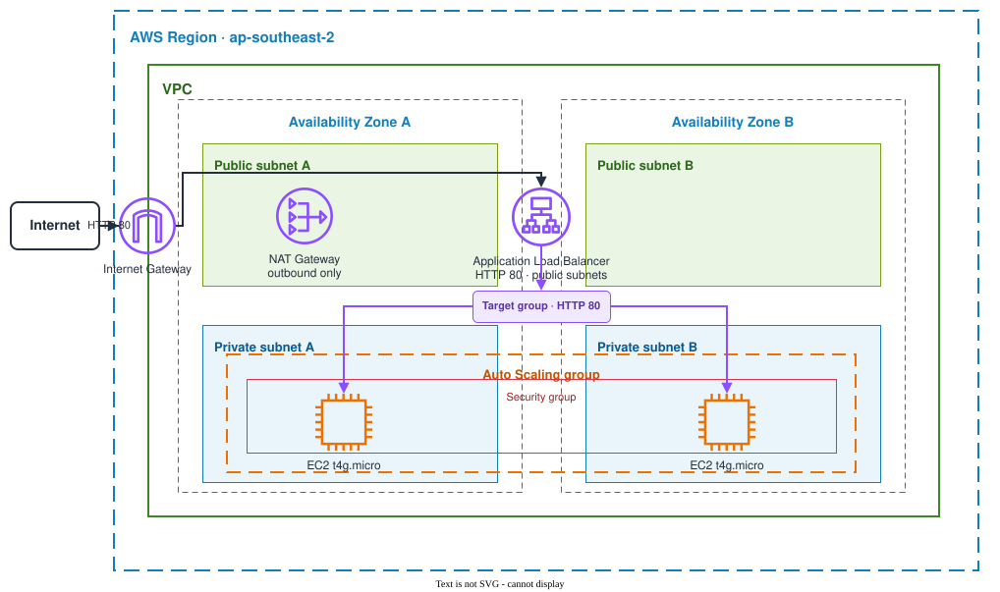

# Global 360 Auto-Healing Web Tier

This repository contains a small auto-healing web tier built on AWS with Terraform. An Application Load Balancer distributes HTTP traffic across two EC2 instances in separate Availability Zones, while an Auto Scaling group maintains capacity and replaces unhealthy instances. Each instance pulls and runs the NGINX site as a Docker container.

## Repository layout

```text
.
├── bootstrap/              # S3 remote state and KMS key
├── environments/
│   ├── staging/            # Staging root module and state
│   └── production/         # Production root module and state
├── modules/
│   ├── network/            # VPC, subnets, routing, and NAT
│   ├── alb/                # Load balancer, health checks, and alarms
│   └── compute/            # Launch template, ASG, IAM, and scaling
├── docker/                 # NGINX image and static page
├── docs/                   # Architecture diagram
├── .github/workflows/      # Terraform and container pipelines
└── Makefile                # Local validation and deployment commands
```

Staging and production use separate Terraform state while sharing the same modules.

## Architecture



The ALB is the only public entry point. It forwards traffic to healthy instances on port 80, and the instance security group accepts that traffic only from the ALB security group.

The two web instances run in private subnets across separate Availability Zones. A single NAT Gateway provides outbound access for package installation, the container image pull, and Session Manager. The ASG normally runs two instances and can scale out to four.

## Why AWS

I chose AWS because Application Load Balancing and EC2 Auto Scaling provide native health-based routing and capacity replacement. AWS also has mature Terraform support and offers Graviton instances that suit a small, low-CPU static workload.

The deployment targets the Sydney region (`ap-southeast-2`).

## Requirement coverage

### Must-haves

- **Self-healing**

  The target group checks `/healthz` every five seconds, and the ASG uses ELB health status rather than EC2 status alone. If an instance stops passing the application health check, it is removed from load-balancer rotation and the ASG is configured to replace it.

  The ASG configuration is in `modules/compute/main.tf`:

  ```hcl
  resource "aws_autoscaling_group" "web" {
    min_size            = var.min_size
    desired_capacity    = var.desired_capacity
    max_size            = var.max_size
    vpc_zone_identifier = var.private_subnet_ids
    target_group_arns   = [var.target_group_arn]

    health_check_type         = "ELB"
    health_check_grace_period = 180
  }
  ```

- **Self-provisioning and idempotence**

  Terraform owns the network, load balancer, compute, IAM, monitoring, and bootstrap configuration. After the one-time backend and variable setup, the environment is planned and applied through the Makefile. A repeated staging plan returned no changes.

  The deployment commands are defined in `Makefile`:

  ```makefile
  plan: init
	terraform -chdir=$(TF_DIR) plan -input=false -lock-timeout=5m \
	  -var-file=$(VAR_FILE) -out=$(PLAN_FILE)

  apply: init
	terraform -chdir=$(TF_DIR) show $(PLAN_FILE)
	terraform -chdir=$(TF_DIR) apply -lock-timeout=5m $(PLAN_FILE)

  deploy: plan
	$(MAKE) apply ENV=$(ENV)
  ```

- **N + 1 capacity**

  The ASG maintains two instances across separate Availability Zones, providing one redundant instance if either instance becomes unavailable.

  The default capacity is defined in `environments/staging/variables.tf`:

  ```hcl
  variable "asg_min_size" {
    default = 2
  }

  variable "asg_desired_capacity" {
    default = 2
  }
  ```

- **Static web page**

  NGINX serves a small project page and exposes a separate `/healthz` endpoint for the ALB.

  The page is stored in `docker/html/index.html`:

  ```html
  <h1>Global 360 Auto-Healing Web Tier</h1>
  <p>Served by NGINX on an EC2 Auto Scaling Group.</p>
  ```

### Bonus

- **Containerised application**

  The Docker image uses pinned base-image digests, runs as the unprivileged NGINX user, and includes a container health check. GitHub Actions is configured to publish ARM64 and AMD64 images to GHCR, and EC2 user-data pulls the selected manifest by digest.

  The main image configuration is in `docker/Dockerfile`:

  ```dockerfile
  FROM nginxinc/nginx-unprivileged:1.31-alpine3.24@sha256:59ccf0943b0b8e8d9e6ea9039a39555730f544701a655c596f7df7d096c593f5

  COPY --chown=0:0 nginx.conf /etc/nginx/conf.d/default.conf
  COPY --from=content --chown=0:0 /content/ /usr/share/nginx/html/

  USER 101
  EXPOSE 8080
  ```

- **Pipeline**

  The Terraform workflow is configured to run formatting, validation, TFLint, and Trivy checks. Authenticated plans are manual and use GitHub OIDC instead of stored AWS access keys. A separate workflow builds and scans the container image.

  The validation matrix is defined in `.github/workflows/terraform.yml`:

  ```yaml
  strategy:
    matrix:
      environment: [staging, production]

  steps:
    - name: Validate environment root
      run: make validate-env ENV=${{ matrix.environment }}
  ```

## Estimated monthly cost

An always-on deployment in AWS Sydney is approximately **AUD 130–135 per month** before tax and significant data transfer.

The main costs are:

- NAT Gateway and its public IPv4 address: about AUD 67/month
- ALB, two public IPv4 addresses, and light LCU usage: about AUD 37/month
- Two `t4g.micro` instances: about AUD 23/month
- EBS, KMS, state storage, and monitoring: about AUD 4/month

If further cost reduction is required, these changes could reduce the estimate by up to approximately **53%**, bringing it to around **AUD 63 per month**:

- Replace the managed NAT Gateway with a self-healing `fck-nat` instance. Keeping the web tier on `t4g.micro` would reduce the estimate to about **AUD 73 per month**.
- Change the web instances from `t4g.micro` to `t4g.nano`, reducing the estimate further to around **AUD 63 per month**.

**Trade-off:** `fck-nat` moves responsibility for patching, routing, ENI/EIP failover, monitoring, and recovery from AWS to this project. The `t4g.nano` instances also provide only 512 MiB of memory, leaving less headroom for the operating system, Docker, NGINX, cloud-init, and the SSM Agent.

Based on the pricing assumptions above, this managed-ALB architecture would not meet the AUD 20 target: the ALB and its two public IPv4 addresses alone cost about **AUD 37 per month**, before adding either EC2 instance.

## Key design decisions and trade-offs

### Private instances

The web instances have no public IP addresses, SSH rule, key pair, or bastion. IMDSv2 is required, EBS volumes are encrypted, and Session Manager provides administrative access. This reduces the public attack surface but creates an outbound connectivity dependency.

### Single NAT Gateway

One NAT Gateway costs less than one per Availability Zone. The trade-off is that losing its Availability Zone removes outbound access from both private subnets. Existing containers can continue serving traffic, but new package downloads, image pulls, and Session Manager connections depend on that path.

### Graviton instances

The web tier uses `t4g.micro`. The container supports ARM64, and 1 GiB of memory provides more practical headroom for Amazon Linux, Docker, NGINX, cloud-init, and the SSM Agent than `t4g.nano`.

### Saved Terraform plans

`make plan` writes a saved plan and `make apply` applies that same file rather than generating a new plan during deployment. This keeps the reviewed plan separate from the apply step.

### HTTP listener

The current scope uses HTTP. A production public service should add a domain and terminate TLS with ACM.

## Prerequisites

- Terraform `1.15.x`
- AWS CLI v2
- `jq`
- Make
- Actionlint `1.7.x`
- TFLint `0.64.x`
- Trivy `0.69.x`
- Docker with Buildx when building the image locally

The examples use `ap-southeast-2`. Confirm the AWS account before creating resources:

```bash
export AWS_PROFILE=<profile>
aws sts get-caller-identity
```

## Plan and deploy

### 1. Bootstrap remote state

The bootstrap stack uses local state because it creates the remote S3 backend and KMS key.

```bash
terraform -chdir=bootstrap init
terraform -chdir=bootstrap plan -out=bootstrap.tfplan
terraform -chdir=bootstrap apply bootstrap.tfplan
terraform -chdir=bootstrap output
```

Copy the backend example and replace its placeholders with the bootstrap outputs:

```bash
cp environments/staging/backend.hcl.example environments/staging/backend.hcl
```

### 2. Configure the environment

```bash
cp environments/staging/terraform.tfvars.example environments/staging/terraform.tfvars
```

Replace the image placeholder in `terraform.tfvars`. The staging image used for this project is pinned by digest:

```text
ghcr.io/heyallensu/global-360-auto-healing-web-tier@sha256:51f91115cb059d75111a85da1abe6905ce0354c3f160cf459205dabcc43fd982
```

### 3. Check, plan, and optionally apply

```bash
make check ENV=staging
make plan ENV=staging
terraform -chdir=environments/staging show staging.tfplan
make apply ENV=staging
```

Stop after reviewing the saved plan if only plan output is required. `make apply` uses only the plan produced by `make plan`.

For a one-command deployment, run `make deploy ENV=staging`. This creates a saved plan and applies that same plan.

### 4. Check the running service

```bash
ALB_URL="$(terraform -chdir=environments/staging output -raw alb_url)"
curl -fsS "${ALB_URL}/healthz"
curl -I "${ALB_URL}"
```

`/healthz` should return `ok`, and the root path should return HTTP 200.

Run a second plan to check idempotence:

```bash
terraform -chdir=environments/staging plan \
  -input=false \
  -lock-timeout=5m \
  -var-file=terraform.tfvars \
  -detailed-exitcode
```

Exit code `0` means the second plan contains no changes.

### 5. Clean up

Destroy the application environment before removing its state backend:

```bash
make destroy ENV=staging
```

The versioned S3 bucket must be emptied before the bootstrap stack can be destroyed. KMS key deletion uses a seven-day waiting period.

## CI/CD

The branch flow is:

```text
feature/* -> develop -> main
               |          |
            staging    production
```

Pull requests to `develop` and `main` are configured to run Terraform validation, TFLint, and Trivy. SonarQube runs for pull requests to `main` and pushes to `main`; its free plan does not provide branch analysis for `develop`.

Authenticated plans are manual. A staging plan can run only from `develop`, and a production plan only from `main`. GitHub Actions assumes an AWS role through OIDC, so there are no long-lived AWS access keys in the repository.

The container workflow builds the image for ARM64 and AMD64, publishes it to GHCR on branch pushes, and scans the pushed digest.

## Verification

Completed checks included Terraform formatting and validation for both environments, Actionlint, TFLint, and Trivy.

The staging deployment registered two healthy `t4g.micro` targets in separate Availability Zones. `/healthz` returned `ok`, the root path returned HTTP 200, and a second Terraform plan returned no changes. Session Manager also confirmed that Docker was active and both containers were healthy.

Self-healing was tested by terminating an EC2 instance and, separately, stopping the application container. In both cases, the ASG replaced the unhealthy instance and the target group returned to two healthy targets.

The staging environment and remote-state resources were destroyed after these checks.

## Further work

- Evaluate `fck-nat` as a lower-cost NAT option
- Add HTTPS with ACM and Route 53
